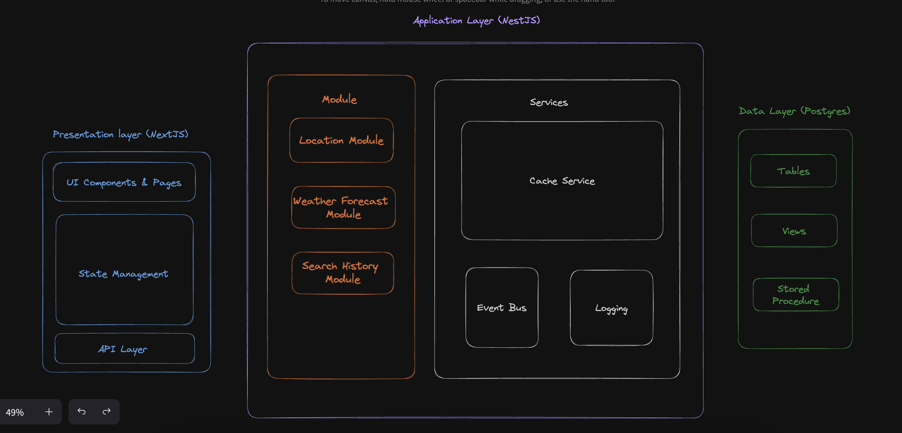
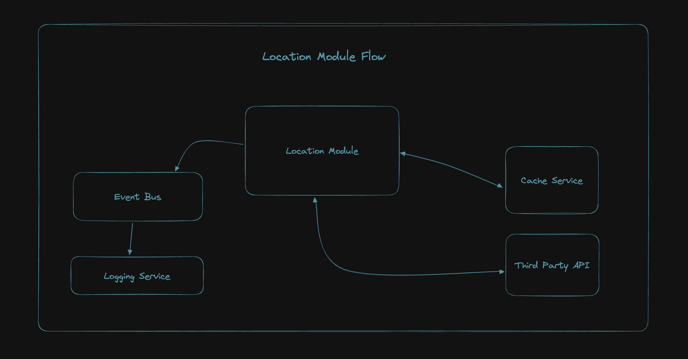
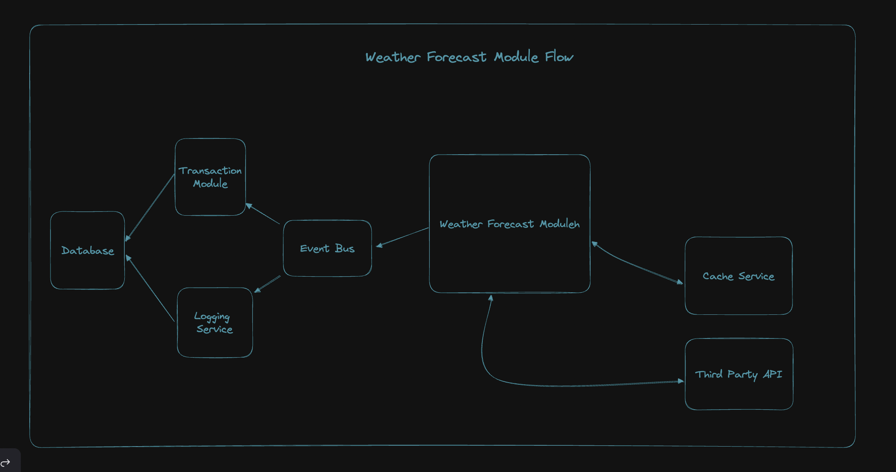
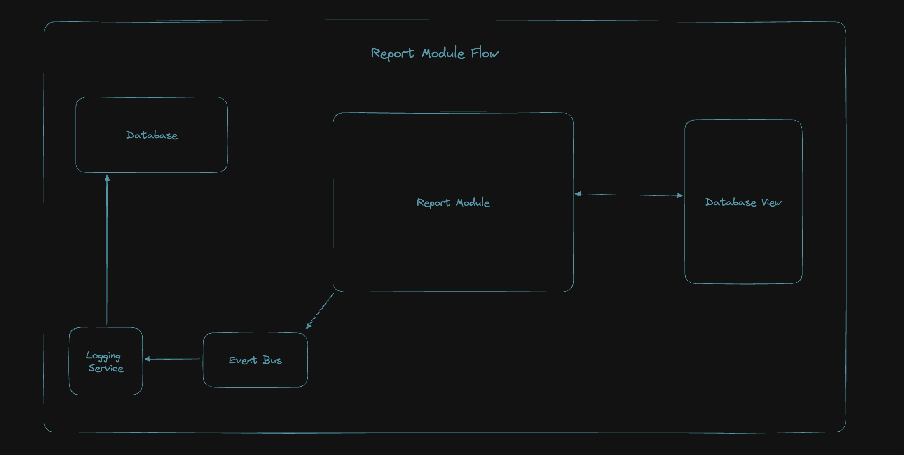

# Turborepo (NestJS + Prisma + NextJS + Tailwind + Typescript + Jest) Starter

This is fullstack turborepo starter. It comes with the following features.

- ✅ Turborepo
- ✅ Nestjs
  - ✅ Env Config with Validation
  - ✅ Prisma
  - ✅ Redis Cache
- ✅ NextJS
  - ✅ Tailwind
  - ✅ Redux Toolkit Query
- ✅ Testing using Jest
- ✅ Github Actions
- ✅ Reverse Proxy using Nginx
- ✅ Docker Integration
- ✅ Postgres Database
- ✅ Package scripts using NPS

## What's inside?

This turborepo uses [Yarn](https://classic.yarnpkg.com/lang/en/) as a package manager. It includes the following packages/apps:

### Apps and Packages

- `api`: a [NestJS](https://nestjs.com/) app
- `web`: a [Next.js](https://nextjs.org) app
- `ui`: a stub React component library used by `web`.
- `config`: `eslint`, `nginx` and `tailwind` (includes `eslint-config-next` and `eslint-config-prettier`)
- `tsconfig`: `tsconfig.json`s used throughout the monorepo

Each package/app is 100% [TypeScript](https://www.typescriptlang.org/).

### Utilities

This turborepo has some additional tools already setup for you:

- [Node Package Scripts](https://github.com/sezna/nps#readme) for automation scripts
- [TypeScript](https://www.typescriptlang.org/) for static type checking
- [ESLint](https://eslint.org/) for code linting
- [Prettier](https://prettier.io) for code formatting

## Setup

This starter kit is using turborepo and yarn workspaces for monorepo workflow.

### Prerequisites

- Node version: 20.10.0
- NPM version : 10.2.3

- You may run the command below if running on MacOS

```
nvm use
```

- For window, you may need to install the version or just use nvm

```
nvm install 20.10.0

nvm use 20.10.0
```

- Install nps by running

```
npm i -g nps
```

- Make sure docker and docker-compose are
  installed. Refer to docs for your operating system.

### Configure Environment

- Frontend
  - `cd apps/web && cp .env.example .env`
- Backend
  - `cd apps/api && cp .env.example .env`

### Install Dependencies

Make sure you are at root of the project and just run

```
nps prepare
```

### Build

To build all apps and packages, run the following command at the root of project:

```
nps build
```

### Develop

To develop all apps and packages, run the following command at the root of project:

```
nps dev
```

The app should be running at `http://localhost` with reverse proxy configured.

## Other available commands

Run `nps` in the terminal to see list of all available commands.

## Assumptions

- I'm using Nextjs instead of just reactjs due to I can skip routing setup and also could utilize the backend to generate session for me.
- For the reverse geocoding, I'm calling an external API which allow me to do batch reverse geocoding. Hence, we might experience a latency on the first load, due to the reverse geocoding process is executing.
- I'm making an assumptions all the locations will be fixed across all date/time. Therefore after the reverse geocoding process, I'm storing all the coordinates with the name into the Radis Cache for future mapping purpose.
- The search history event for store into database only happens upon user click on the location card.
- For the report apis, I'm using normal view for ReportB and materialized view for ReportC.
- I'm also doing a client session with NextAuth, so my backend is stateless.

## Architecture

- Overall architecture
  

- How all the module interact with all the tech or stack.
  - Location Module
    
  - Weather Module
    
  - Search History Module
    

## Limitations

- Test case wasn't fully covered, dropped test case for frontend due to time constraint
- Logging wasn't in placed as well.
